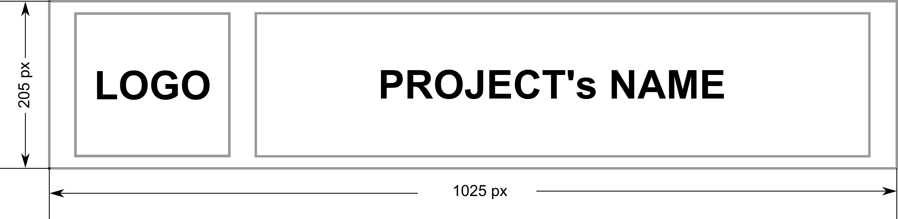

# OmniPath Utils

- [ ] TODO: Add badges to your project.

[](https://github.com/saezlab/omnipath-utils/actions/workflows/ci-testing-unit.yml)
[](https://codecov.io/gh/saezlab/omnipath-utils)
[](https://saezlab.github.io/omnipath-utils/)


## Description

ID translation, taxonomy, orthology and reference lists for molecular biology

## Installation

- [ ] TODO: Add installation instructions for your project, if applicable.

```bash
# Example
pip install <name-of-my-project>
```

## Usage

- [ ] TODO: Add usage instructions for your project.

```python
import foobar

# returns 'words'
foobar.pluralize('word')

# returns 'geese'
foobar.pluralize('goose')

# returns 'phenomenon'
foobar.singularize('phenomena')
```

## Contributing

Pull requests are welcome. For major changes, please open an issue first
to discuss what you would like to change.

Please make sure to update tests as appropriate.

- [ ] TODO: add contribution guidelines. All of them can be modified in the mkdocs documentation (./docs/community)

## License

[MIT](https://choosealicense.com/licenses/mit/)

- [ ] TODO: Modify this based on the license you choose.
- [ ] TODO: Modify the LICENSE file based on the license you choose.
